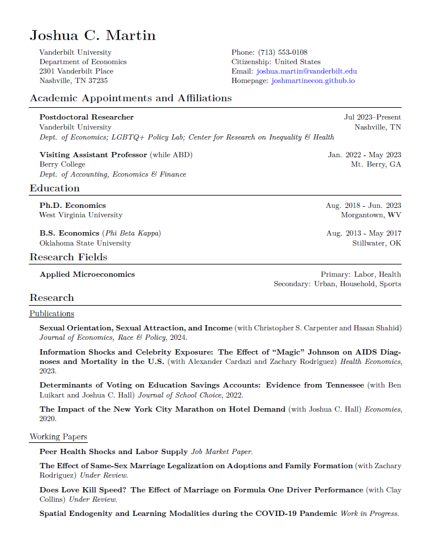
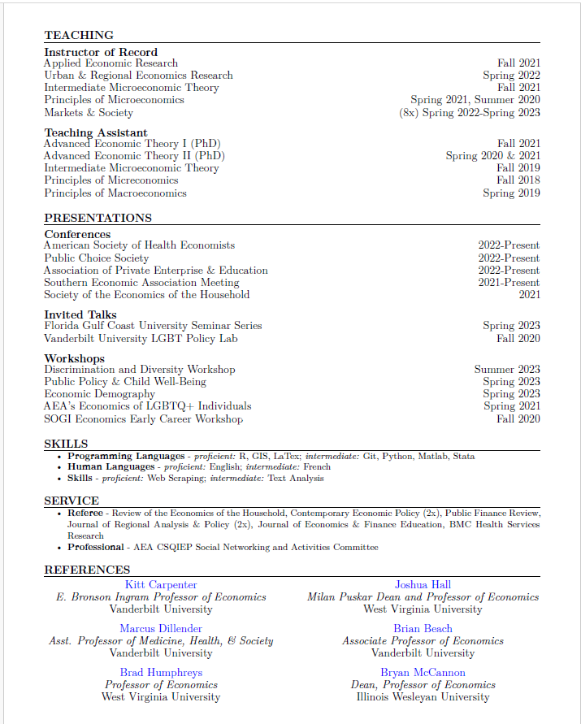

# CV Template

A [Quarto](https://quarto.org/) template for compiling an academic CV. Work in progress.

## Example

Below is an example of my own personal CV as of 1/15/25. Click either of the pictures to go an updated version.

### Page 1

[Source Code](https://github.com/joshmartinecon/quarto-cv/blob/main/joshmartin_cv.qmd)

### Page 2
  

[Source Code](https://github.com/joshmartinecon/quarto-cv/blob/main/joshmartin_cv.qmd)
